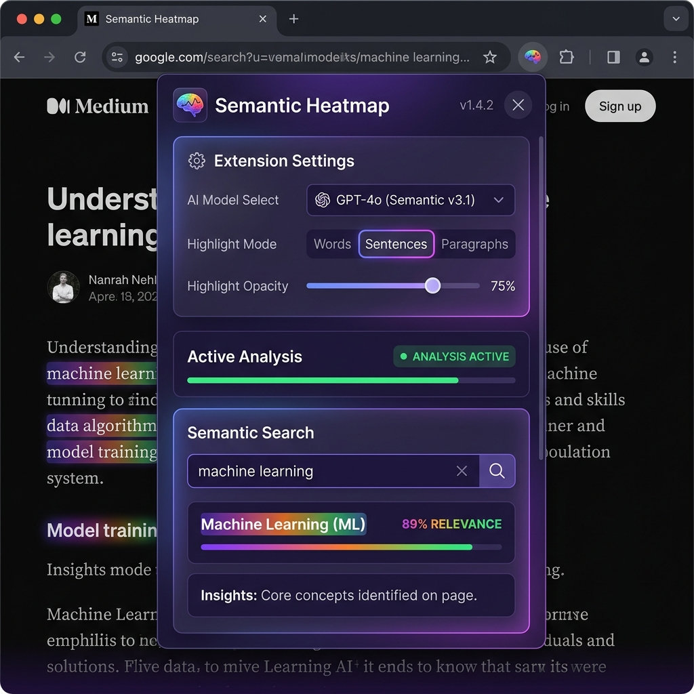

# Semantic Heatmap & Search Chrome Extension



An elegant Chrome Extension that scans the DOM of any webpage, extracts the text content of its elements, generates high-dimensional semantic embedding vectors locally using **Transformers.js**, and maps those vectors to visual heatmaps or enables real-time concept-based **Semantic Search**.

This turns the page into an interactive visual heatmap where elements with similar meanings have the same color, or where you can search for concepts and see matching elements highlighted while the rest of the page fades out.

---

## Key Features

- **Local AI Inference**: Uses Transformers.js (`@xenova/transformers`) to generate sentence embeddings directly in your browser.
- **Mathematical Color Mapping (PCA)**: Projects 384-dimensional embeddings down to 3 coordinates ($p_1, p_2, p_3$) capturing the directions of maximum variance, then maps them onto the HSL color wheel or RGB channels.
- **Perceptual HSL Mode (Recommended)**: Maps the primary semantic axis (PC1) to Hue ($0\text{-}360^\circ$) while keeping Saturation and Lightness controlled, ensuring text remains highly legible.
- **Concept Semantic Search**: Type any query (e.g., "artificial intelligence", "healthy recipes") and see the page transform. Matching elements glow in gold (scaled by similarity strength) while non-matching elements fade to 15% opacity.
- **Interactive Results List**: Shows the top 5 matching text snippets inside the popup. Clicking on any result smoothly scrolls the webpage to the element and flashes it in blue.
- **Real-Time Styling Controls**: Adjust opacity, toggle color highlight modes (Solid Background, Border Glow, Text Color), and switch between HSL and RGB color models instantaneously without re-running model inference.
- **Dynamic Content Injection**: Automatically injects scripts into tabs that were opened before the extension was installed, ensuring a bulletproof user experience.
- **Glassmorphism UI**: A gorgeous, dark-themed popup designed using modern aesthetic tokens (Outfit font, glowing elements, and animated loading indicators).

---

## Extension Structure

```
├── manifest.json            # Manifest V3 configuration with WebAssembly CSP
├── popup.html               # Popup layout (HTML)
├── popup.css                # Premium custom styling (CSS)
├── popup.js                 # Controls popup UI and states, coordinates scripts
├── background.js            # Background service worker; loads model, caches vectors & runs PCA
├── content.js               # Content script; extracts text, applies styling & highlights search
├── icons/                   # Generated extension icons & screenshots
│   ├── icon-16.png
│   ├── icon-48.png
│   ├── icon-128.png
│   └── screenshot.png       # UI usage screenshot mockup
└── lib/
    └── transformers/        # Bundled Transformers.js & ONNX WebAssembly files
        ├── transformers.js
        ├── ort-wasm.wasm
        ├── ort-wasm-simd.wasm
        ├── ort-wasm-threaded.wasm
        └── ort-wasm-simd-threaded.wasm
```

---

## Installation Guide

1. Open Google Chrome and navigate to `chrome://extensions/`.
2. Enable **Developer mode** using the toggle switch in the top-right corner.
3. Click the **Load unpacked** button in the top-left.
4. Select the directory `/home/gnanasekar/semantic` containing these extension files.
5. The extension icon will appear in your extensions list. Pin it to your toolbar for easy access!

---

## How It Works Under the Hood

### 1. DOM Traversal & Selection
When you click **Generate Heatmap**, `content.js` uses a `TreeWalker` to traverse visible elements in the webpage's body. It excludes structural and scripting tags (`<script>`, `<style>`, `<nav>`, `<input>`, etc.). It extracts the **direct text content** of each node to avoid redundant parent-child sentence overlaps, assigning each node a unique `data-semantic-id`.

### 2. Sentence Embedding Generation
The text blocks are sent to `background.js` which initializes the `feature-extraction` pipeline. The default model is `Xenova/all-MiniLM-L6-v2` (approx. 90MB), which outputs a **384-dimensional** vector for each text element. The processing runs in a single batched tensor operation, which is highly optimized.
*Note: env.backends.onnx.wasm.numThreads = 1 is set to enforce single-threaded execution to comply with browser safety rules regarding blocking Atomics.wait calls on the main thread.*

### 3. Principal Component Analysis (PCA)
To map the 384-dimensional semantic vectors to a 3D color space, we compute:
1. The **mean vector** across all elements.
2. The **covariance matrix** ($384 \times 384$) of the mean-centered vectors.
3. The **top 3 eigenvectors** ($u_1, u_2, u_3$) using **Power Iteration** (with matrix deflation).
4. The projection of each centered vector onto these eigenvectors:
   $$p_d = \vec{v}_{\text{centered}} \cdot \vec{u}_d$$
This yields three values $(p_1, p_2, p_3)$ per element representing its major semantic coordinates.

### 4. Perceptual Color Assignment
The coordinates are normalized across all elements to a $[0, 1]$ scale:
- **Hue**: The first principal component (PC1, representing the largest semantic difference) is mapped directly to a Hue angle ($0^\circ \text{ to } 360^\circ$).
- **Saturation**: PC2 is mapped to a vibrant Saturation range ($75\% \text{ to } 100\%$).
- **Lightness**: PC3 is mapped to a readable Lightness range ($45\% \text{ to } 70\%$).

This guarantees that:
- Elements with **similar meanings** cluster together on the color wheel and share almost identical colors.
- Elements with **differing meanings** stand out on opposite ends of the color spectrum.
- Text remains highly legible under all highlights.

### 5. Semantic Search & Cosine Similarity
When the user queries a concept, the query is embedded into a 384-dimensional vector $\vec{q}$ in the background. Because vectors are L2-normalized ($\|\vec{v}\|_2 = 1$), the **cosine similarity** is computed as the dot product:

$$\text{Similarity}(\vec{q}, \vec{e}) = \vec{q} \cdot \vec{e} = \sum_{i=1}^{384} q_i e_i$$

Matching elements are highlighted with a glowing gold color scale, while irrelevant elements are faded to 15% opacity to stand out.
When a result in the popup is clicked, the page scrolls smoothly to the element and flashes it in blue to focus the user's attention.
Clear Search restores the original multi-colored heatmap state instantly.
